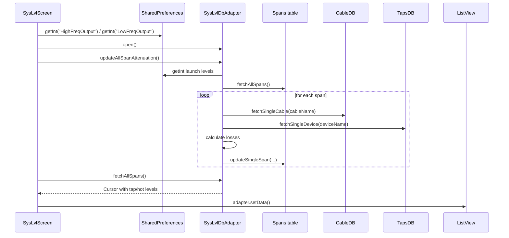
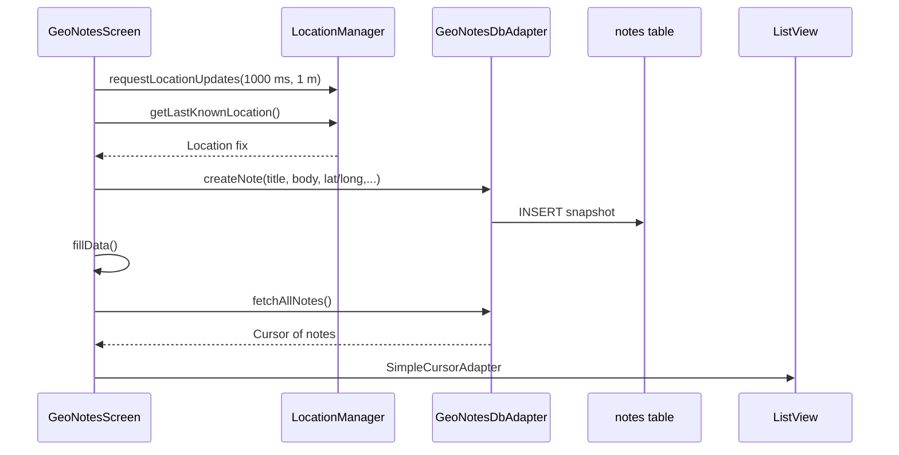

# SysLvl Legacy Workflows

## Overview
This repository contains two legacy Android workflows that continue to inform how downstream tooling integrates with SysLvl data:

- **Span attenuation planning** in `SysLvlScreen`, which calculates signal levels for a run of plant spans and surfaces them in a list.
- **Geo-notes capture** in `GeoNotesScreen`, which snapshots the device's current GPS fix and stores the reading for later review.

The sections below document the primary data sources, transformations, and outputs for each workflow so that dependent services can maintain the same assumptions.

## Span Attenuation Workflow
`SysLvlScreen.fillData()` orchestrates user preference reads, span attenuation refreshes, and list rendering.

- **Inputs:** The screen opens the shared preferences file `SYSLVL_PREFS` to pull the latest high- and low-frequency launch levels (`HighFreqOutput`, `LowFreqOutput`), defaulting to 45 dBmV and 36 dBmV when unset.【F:src/com/StupidRat/SysLvl/SysLvlScreen.java†L60-L77】
- **Processing:** The screen opens `SysLvlDbAdapter`, which recomputes every span's tap and hot levels by iterating the `Spans` table and joining against `CableDB` and `TapsDB`. For each span it calculates cable loss, subtracts tap/hot losses, writes the rounded values back via `updateSingleSpan`, and chains the downstream starting levels to the next span by carrying forward the hot output.【F:src/com/StupidRat/SysLvl/SysLvlScreen.java†L82-L128】【F:src/com/StupidRat/SysLvl/SysLvlDbAdapter.java†L237-L332】
- **Outputs:** After recomputation, `fillData()` fetches the updated spans, formats each into a descriptive string (distance, cable, device, tap/hot outputs), and binds the array into the `ListView` through `NewQAAdapter`. This refreshed list drives the popup actions for per-span details, ordering, and deletion.【F:src/com/StupidRat/SysLvl/SysLvlScreen.java†L101-L190】

## Geo Notes Capture Workflow
`GeoNotesScreen.showCurrentLocation()` snapshots the device's GPS reading into the local notes database and immediately refreshes the list.

- **Inputs:** A `LocationManager` delivers `GPS_PROVIDER` updates every 1,000 ms or when the device has moved 1 meter, whichever comes first. When the user taps **Retrieve Location**, the screen pulls the last known fix and displays its reported accuracy.【F:src/com/StupidRat/SysLvl/GeoNotesScreen.java†L24-L86】
- **Processing:** The method formats the longitude/latitude pair into a human-readable title and body, then calls `GeoNotesDbAdapter.createNote(...)` to persist the reading (plus placeholders for lat/long/street/state/zip fields) into the `notes` table.【F:src/com/StupidRat/SysLvl/GeoNotesScreen.java†L88-L137】【F:src/com/StupidRat/SysLvl/GeoNotesDbAdapter.java†L12-L104】
- **Outputs:** After writing, it invokes `fillData()` to query all notes and bind them to the `ListView` through a `SimpleCursorAdapter`, ensuring the newest snapshot is visible immediately.【F:src/com/StupidRat/SysLvl/GeoNotesScreen.java†L139-L193】

## Shared Preference Keys & GPS Cadence
Downstream services should continue to honor the following persisted configuration and sampling behavior:

- `HighFreqOutput` — integer launch level in dBmV used as the starting 550 MHz signal reference. Stored in shared preferences with a default of `45` when unset.【F:src/com/StupidRat/SysLvl/SysLvlScreen.java†L67-L76】【F:src/com/StupidRat/SysLvl/SysLvlDbAdapter.java†L260-L331】
- `LowFreqOutput` — integer launch level in dBmV used as the starting 55 MHz signal reference. Stored in shared preferences with a default of `36` when unset.【F:src/com/StupidRat/SysLvl/SysLvlScreen.java†L67-L76】【F:src/com/StupidRat/SysLvl/SysLvlDbAdapter.java†L260-L331】
- GPS updates arrive from `LocationManager.GPS_PROVIDER` every 1 second (`MINIMUM_TIME_BETWEEN_UPDATES = 1000`) or 1 meter of movement (`MINIMUM_DISTANCE_CHANGE_FOR_UPDATES = 1`). Services consuming these notes should assume snapshots can be as frequent as this cadence, though captures only occur when the user explicitly requests them.【F:src/com/StupidRat/SysLvl/GeoNotesScreen.java†L24-L115】

Maintaining these assumptions ensures the existing attenuation calculations and geo-note synchronization logic stay aligned as the system evolves.
